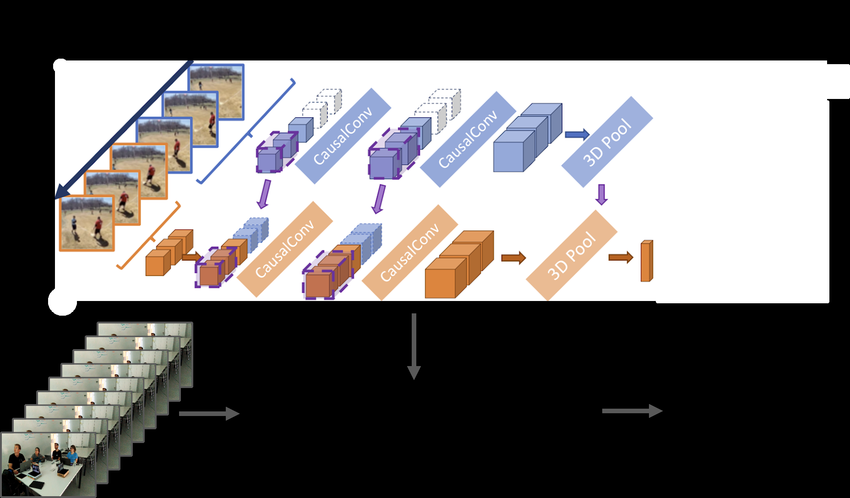

# **Sport-Searcher**

## **A Simple Video Classification Model using MoViNets**

A simple video classification model built to classify into one of four sports of interest: **Cricket**, **Baseball**, **Soccer**, and **Basketball** (Baseball redacted due to memory issues (Not hardware. Mine.)

**Note:** Written thought process notes are available in the [Assets](Assets) folder.

**Loom Video Recording:** [Watch the video](https://www.loom.com/share/49ebd89f8d55415fb3a373f1e8dce172?sid=a632f607-1497-46fe-bf1b-6e2dadb04d16)

## Models and why they were not considered (list based on benchmarks in paperswithcode for Video Classification):

| Name                                                         | Based on                       | Why not considered?                                          |
| ------------------------------------------------------------ | ------------------------------ | ------------------------------------------------------------ |
| [HERMES](https://github.com/joslefaure/HERMES)               | Transformers+LLM               | Too heavy, inference itself required 4 GPUs                  |
| [VideoMAE](https://huggingface.co/docs/transformers/en/tasks/video_classification) | Vision Transformers (ViT)      | Small compared to HERMES, but still slightly heavier compared to CNN based models due to Transformers dependency (Informal note: Also, I wanted to work see how a traditional CNN model would do out of curiosity) |
| [MoViNet](https://www.tensorflow.org/hub/tutorials/movinet)  | CNN family + NAS + CausalConvs | Optimized for realtime streaming, this purely CNN based model seemed like a good tradeoff between latency, and accuracy for me. |
| [3D CNNs](https://www.tensorflow.org/tutorials/video/video_classification) | 3D CNNs                        | No contextual understanding but kept this as backup. Nothing wrong with it, just wanted to try MoViNet and then move to this. |
| [CNN+RNN](https://keras.io/examples/vision/video_classification/) | CNN + RNNs                     | Heavier than a standard CNN based model, Inference is slower and frame for processing is not Dynamic as MoViNet. |

## Datasets and why they were not considered/challenges faced

| Name       | Advantages                                                   | Challenges faced                                             |
| ---------- | ------------------------------------------------------------ | ------------------------------------------------------------ |
| Sports-1m  | Highly reliable dataset for many actions in sports. Well written documentation and straightforward. (PS Andrej Karpathy had created it) | Dataset has died away due to changing rules of Youtube API calls |
| UCF-101    | Reliable and well-documented from everywhere                 | Dirty dataset, low number of classes and samples for reqd problem statement |
| HMDB51     | Action recognition dataset                                   | No sports                                                    |
| Youtube-8M | Relatively newer than all, running under Youtube itself      | Dataset was hard to train, Documentation was too complex to understand |

## A little about MoViNets:

MoViNet, short for **Mobile Video Networks**, is a cutting-edge architecture designed for efficient video classification, particularly optimized for mobile devices. Developed by Google researchers, MoViNet leverages advanced techniques to achieve high accuracy while minimizing computational demands.

## **Key Features of MoViNet**

- **Efficiency**: MoViNet models are designed to operate with significantly lower latency and memory usage compared to traditional 3D CNNs, making them suitable for real-time applications on smartphones and edge devices. Hence, I felt that by converting them to tflite, I could achieve ease of deployment on different devices/hardware.
- **Neural Architecture Search (NAS)**: The models are generated using NAS, which helps in discovering optimal configurations that balance accuracy and computational efficiency.
- **Stream Buffer Technique**: This innovative method allows MoViNet to handle streaming video inputs without being constrained by the length of the video clips. It enables the model to maintain a constant memory footprint regardless of the input duration.

## **MoViNet A2-Stream**

Among the various configurations of MoViNet, the **MoViNet A2-Stream** model stands out due to its balance of performance and efficiency. Here are some key specifications:

| Model Name        | Top-1 Accuracy (%) | Latency (ms) | Model Size (MB) | Recommended Input Size |
| ----------------- | ------------------ | ------------ | --------------- | ---------------------- |
| MoViNet-A2-Stream | 78.40              | 15.76        | 5.1             | 224 x 224              |

The A2-Stream model is particularly effective for real-time video classification tasks, achieving a high accuracy rate while maintaining low latency, making it ideal for applications where quick response times are critical. 

## **Visual Representation**

Here’s a diagram illustrating the architecture of MoViNets:

Here's a diagram officially from the authors explaining the difference between streaming evaluation and multi-clip evaluation:

## **Applications**

MoViNet can classify various human actions in videos, such as playing sports or performing artistic activities. Its ability to process video streams in real time opens up possibilities for applications in surveillance, sports analytics, and interactive media. 

In summary, MoViNet and its A2-Stream variant provide a powerful solution for efficient video classification on mobile platforms, combining advanced neural network techniques with practical design considerations for real-world applications.

